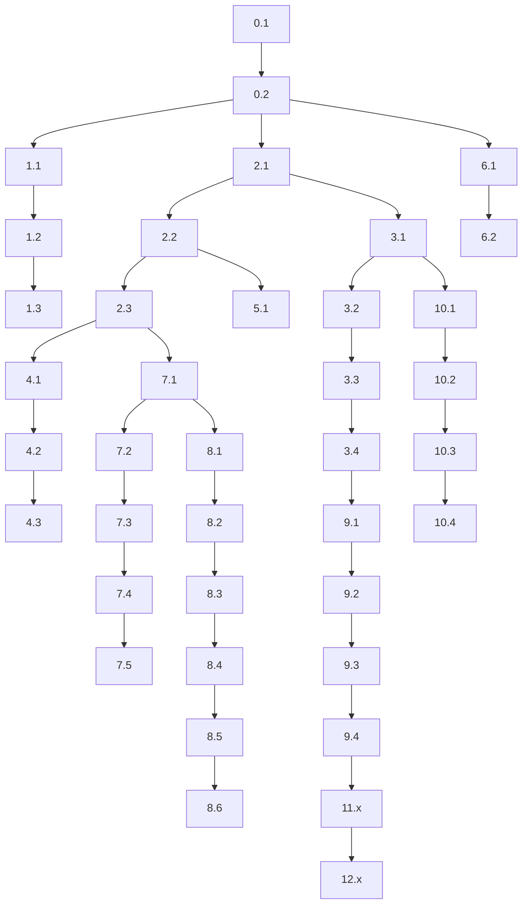

# konven (`gcv`) — Implementation Plan

Micro-scope breakdown. Each scope = **1 commit / 1 PR**. Order matters.

See [spec.md](./spec.md) for product requirements.

---

## Locked decisions

| # | Decision |
|---|----------|
| 1 | `gcv fix auth` → scope + missing message **only if** `auth` is in config scopes; else `fix` + message `"auth"` |
| 2 | Inline fallback: valid fields **prefilled + locked** (not editable) |
| 3 | `gcv init` writes to **cwd**; if cwd ≠ git root → confirm first |
| 4 | Config = **`.gc.json` only** |
| 5 | Malformed config → **error upfront**, no silent fallback to defaults |

---

## Scope 0 — Repo bootstrap

### [ ] 0.1 `chore: init package.json and tsconfig`

**Files:** `package.json`, `tsconfig.json`, `.gitignore`

- Package name: `konven`
- Bin: `gcv` → `dist/index.js`
- Scripts: `build`, `dev`, `typecheck`
- TS: strict mode
- Ignore: `node_modules/`, `dist/`

**Done when:** `npm run build` succeeds (empty entry ok)

---

### [ ] 0.2 `chore: add project file skeleton`

**Files:** empty stubs only

```
src/index.ts
src/commands/init.ts
src/commands/commit.ts
src/config/types.ts
src/config/defaults.ts
src/config/indexes.ts
src/config/loader.ts
src/validate.ts
src/git/repo.ts
src/git/staged.ts
src/git/commit.ts
src/format/message.ts
src/parse/types.ts
src/parse/inline.ts
src/prompt/fields.ts
src/prompt/commit-prompt.ts
```

- Export placeholders, no logic yet

**Done when:** build passes, all modules import cleanly

---

## Scope 1 — CLI shell

### [ ] 1.1 `feat(cli): parse argv and route commands`

**File:** `src/index.ts`

- Parse `process.argv.slice(2)`
- Routes:
  - no args → commit interactive
  - `init` → init command
  - `--help` / `-h` → help
  - `--version` / `-v` → version
  - else → inline commit args
- Unknown flags → print help, exit 1

**Done when:** each route calls stub handler

---

### [ ] 1.2 `feat(cli): add --help output`

**File:** `src/index.ts` or `src/cli/help.ts`

- Usage, commands, inline syntax, config note
- Document 2-arg disambiguation behavior

**Done when:** `gcv --help` prints stable text

---

### [ ] 1.3 `feat(cli): add --version output`

**File:** `src/index.ts`

- Read version from `package.json`

**Done when:** `gcv --version` prints semver

---

## Scope 2 — Config types + defaults

### [ ] 2.1 `feat(config): define GcConfig types`

**File:** `src/config/types.ts`

```ts
type GcScope = { name: string; team?: string }
type GcConfig = { types: string[]; scopes: GcScope[] }
type LoadedConfig = { config: GcConfig | null; path: string | null }
type ConfigIndexes = {
  typeSet: Set<string>
  scopeSet: Set<string>
  scopeTeamMap: Map<string, string>
}
```

**Done when:** types exported, no runtime code

---

### [ ] 2.2 `feat(config): add default conventional types`

**File:** `src/config/defaults.ts`

- Export `DEFAULT_TYPES`: feat, fix, chore, docs, refactor, test, style, perf, ci, build, revert
- Export `createDefaultConfig()` returning types only, empty scopes

**Done when:** unit-testable constant list

---

### [ ] 2.3 `feat(config): build lookup indexes from config`

**File:** `src/config/indexes.ts`

- `buildConfigIndexes(config): ConfigIndexes`
- O(n) once at load time
- Used for O(1) inline disambiguation

**Done when:** given sample config, sets/maps are correct

---

## Scope 3 — Config loader

### [ ] 3.1 `feat(git): detect repo root from cwd`

**File:** `src/git/repo.ts`

- Walk up from cwd looking for `.git`
- Return `{ repoRoot, isAtRoot }`
- Used by loader + init

**Done when:** works inside/outside repo, at root/subdir

---

### [ ] 3.2 `feat(config): walk up and find .gc.json`

**File:** `src/config/loader.ts`

- From cwd → repo root, check each dir for `.gc.json`
- Return `{ config: null, path: null }` if not found
- Do not parse yet

**Done when:** finds nearest config file path

---

### [ ] 3.3 `feat(config): parse and validate .gc.json schema`

**File:** `src/config/loader.ts`

- `JSON.parse` file
- Validate:
  - `types` is non-empty `string[]`
  - `scopes` is array of `{ name: string, team?: string }`
  - scope names unique
- On failure → throw typed error with file path + reason

**Done when:** valid file loads; bad file throws clear error

---

### [ ] 3.4 `feat(config): expose loadConfig() with indexes`

**File:** `src/config/loader.ts`

- `loadConfig(): { loaded, indexes, effectiveTypes }`
- No config → `effectiveTypes = DEFAULT_TYPES`, empty scope indexes
- Has config → use config types/scopes
- Malformed → propagate error (no fallback)

**Done when:** single entry point for rest of app

---

## Scope 4 — Validation

### [ ] 4.1 `feat(validate): isValidType helper`

**File:** `src/validate.ts`

- With config: check `typeSet`
- Without config: always valid (free text)

**Done when:** pure function, tested

---

### [ ] 4.2 `feat(validate): isValidScope helper`

**File:** `src/validate.ts`

- With config: check `scopeSet`
- Without config: always valid

**Done when:** pure function, tested

---

### [ ] 4.3 `feat(validate): resolve scope team prefix`

**File:** `src/validate.ts`

- `getTeamPrefix(scope, scopeTeamMap): string | undefined`

**Done when:** returns team only when defined

---

## Scope 5 — Message formatting

### [ ] 5.1 `feat(format): build conventional commit string`

**File:** `src/format/message.ts`

```ts
formatCommitMessage({ type, scope?, message, teamPrefix? }): string
```

Rules:

- no scope → `type: message`
- with scope → `type(scope): message`
- with team → `type(scope): TEAM message` (single space after TEAM)

**Done when:** all 3 variants covered by tests

---

## Scope 6 — Git helpers

### [ ] 6.1 `feat(git): check staged files`

**File:** `src/git/staged.ts`

- `hasStagedFiles(): boolean` via `git diff --cached --quiet` or equivalent
- On git error → friendly message, exit 1

**Done when:** returns true/false reliably

---

### [ ] 6.2 `feat(git): execute commit`

**File:** `src/git/commit.ts`

- `runGitCommit(message: string): void`
- Use `execSync('git commit -m ...')` with proper escaping
- Surface git stderr on failure

**Done when:** commits with quoted message safely

---

## Scope 7 — Inline parser (pure, no prompts)

### [ ] 7.1 `feat(parse): define ParsedInlineResult type`

**File:** `src/parse/types.ts`

```ts
type ParsedInline = {
  type?: string
  scope?: string
  message?: string
  mode: 'complete' | 'partial'
  partialReason?: 'missing-message' | 'invalid-type' | 'invalid-scope'
}
```

**Done when:** shared between parser + commit command

---

### [ ] 7.2 `feat(parse): handle 1-arg inline input`

**File:** `src/parse/inline.ts`

- 1 arg → `{ message, mode: 'partial' }`

**Done when:** tested

---

### [ ] 7.3 `feat(parse): handle 2-arg disambiguation`

**File:** `src/parse/inline.ts`

Logic:

```
args = [type, token]
if config && token in scopeSet:
  return { type, scope: token, mode: 'partial', partialReason: 'missing-message' }
else:
  return { type, message: token, mode: 'complete' }
```

- No config → always `type + message`
- O(1) via `scopeSet.has(token)`

**Done when:**

- `gcv fix update readme` → complete
- `gcv fix auth` + auth in config → partial, missing message
- `gcv fix auth` + auth not in config → complete, message "auth"

---

### [ ] 7.4 `feat(parse): handle 3+ arg inline input`

**File:** `src/parse/inline.ts`

- `[type, scope, ...rest]` → message = rest joined with space

**Done when:** `gcv feat auth fix svg images` parses correctly

---

### [ ] 7.5 `feat(parse): validate parsed inline against config`

**File:** `src/parse/inline.ts`

- After structural parse, if config exists:
  - invalid type → partial + reason
  - invalid scope → partial + reason
- Never throw; always return partial/complete

**Done when:** invalid type/scope marks partial, keeps values

---

## Scope 8 — Prompt primitives

### [ ] 8.1 `feat(prompt): define PromptState model`

**File:** `src/prompt/fields.ts`

```ts
type FieldState<T> = {
  value?: T
  locked: boolean
  invalid?: string
}
type CommitPromptState = {
  type: FieldState<string>
  scope: FieldState<string | undefined>
  message: FieldState<string>
  focus: 'type' | 'scope' | 'message'
}
```

**Done when:** helpers to build state from ParsedInline

---

### [ ] 8.2 `feat(prompt): map ParsedInline → PromptState`

**File:** `src/prompt/fields.ts`

- Valid fields → locked=true
- Invalid fields → locked=false, invalid set
- focus = first invalid in order type → scope → message

**Done when:** all partialReason cases produce correct focus

---

### [ ] 8.3 `feat(prompt): type selector with filter`

**File:** `src/prompt/commit-prompt.ts`

- `@inquirer/prompts` select/search
- Skip if locked (show value, no prompt)
- Uses effectiveTypes list

**Done when:** can pick type interactively

---

### [ ] 8.4 `feat(prompt): optional scope selector`

**File:** `src/prompt/commit-prompt.ts`

- Select from config scopes; Enter skips
- No config → free text input (optional)
- Skip if locked

**Done when:** skip yields `undefined`, not empty string

---

### [ ] 8.5 `feat(prompt): message input`

**File:** `src/prompt/commit-prompt.ts`

- Required unless locked prefilled
- Trim whitespace
- Reject empty → re-prompt

**Done when:** non-empty message required

---

### [ ] 8.6 `feat(prompt): Esc cancels without commit`

**File:** `src/prompt/commit-prompt.ts`

- Catch cancel signal from inquirer
- Exit 0, no git call

**Done when:** Esc exits cleanly

---

## Scope 9 — Commit command (wire together)

### [ ] 9.1 `feat(commit): staged-files guard`

**File:** `src/commands/commit.ts`

- First step in all commit paths
- If none staged → print spec message, exit 0

**Done when:** blocks commit when nothing staged

---

### [ ] 9.2 `feat(commit): interactive-only flow`

**File:** `src/commands/commit.ts`

- No inline args path
- Load config (error if malformed)
- Run full prompt → format → git commit

**Done when:** `gcv` works end-to-end interactively

---

### [ ] 9.3 `feat(commit): inline complete fast path`

**File:** `src/commands/commit.ts`

- If parse result `complete` + all valid → skip prompt
- Format + commit directly

**Done when:** `gcv fix update readme` commits without prompt

---

### [ ] 9.4 `feat(commit): inline partial → locked fallback prompt`

**File:** `src/commands/commit.ts`

- Partial parse → build PromptState → prompt only unlocked fields
- Then format + commit

**Done when:** invalid type opens prompt on type field, valid fields locked

---

## Scope 10 — Init command

### [ ] 10.1 `feat(init): prompt for defaults and scopes choice`

**File:** `src/commands/init.ts`

- Ask: add default types? (Yes/No)
- Ask: add scopes now or later?

**Done when:** answers captured, no file write yet

---

### [ ] 10.2 `feat(init): collect scopes with optional team`

**File:** `src/commands/init.ts`

- Loop: scope name (required), team (optional)
- "Add another?" until No

**Done when:** builds scopes array

---

### [ ] 10.3 `feat(init): cwd location check + confirm`

**File:** `src/commands/init.ts`

- Use `repo.ts`
- If cwd !== repoRoot → confirm: "Not at repo root. Write .gc.json here anyway?"
- No → exit 0

**Done when:** subdir init asks confirmation

---

### [ ] 10.4 `feat(init): write .gc.json safely`

**File:** `src/commands/init.ts`

- Target: `./.gc.json` in cwd
- If exists → confirm overwrite
- Pretty-print JSON (2-space indent)
- Success message with path

**Done when:** valid `.gc.json` written

---

## Scope 11 — Tests

### [ ] 11.1 `test(config): loader + schema errors`

### [ ] 11.2 `test(parse): 1/2/3+ arg cases incl. disambiguation`

### [ ] 11.3 `test(format): message variants + team prefix`

### [ ] 11.4 `test(validate): with/without config`

### [ ] 11.5 `test(prompt): PromptState mapping + focus order`

### [ ] 11.6 `test(git): staged check + commit escaping` (mock execSync)

Each = own commit.

---

## Scope 12 — Docs + release

### [ ] 12.1 `docs: add README with install and usage`

### [ ] 12.2 `chore: add .gc.json dogfood config`

### [ ] 12.3 `chore(release): prep v0.1.0 bin + publish metadata`

---

## Dependency graph



---

## Suggested PR grouping

| PR | Commits |
|----|---------|
| PR-1 Bootstrap | 0.1–0.2, 1.1–1.3 |
| PR-2 Config | 2.x, 3.x, 4.x |
| PR-3 Core utils | 5.1, 6.1–6.2, 7.x |
| PR-4 Prompt | 8.x |
| PR-5 Commit flow | 9.x |
| PR-6 Init | 10.x |
| PR-7 Quality | 11.x, 12.x |

---

## Progress tracker

Total scopes: **40**

- [ ] Scope 0 — Repo bootstrap (0.1–0.2)
- [ ] Scope 1 — CLI shell (1.1–1.3)
- [ ] Scope 2 — Config types + defaults (2.1–2.3)
- [ ] Scope 3 — Config loader (3.1–3.4)
- [ ] Scope 4 — Validation (4.1–4.3)
- [ ] Scope 5 — Message formatting (5.1)
- [ ] Scope 6 — Git helpers (6.1–6.2)
- [ ] Scope 7 — Inline parser (7.1–7.5)
- [ ] Scope 8 — Prompt primitives (8.1–8.6)
- [ ] Scope 9 — Commit command (9.1–9.4)
- [ ] Scope 10 — Init command (10.1–10.4)
- [ ] Scope 11 — Tests (11.1–11.6)
- [ ] Scope 12 — Docs + release (12.1–12.3)
